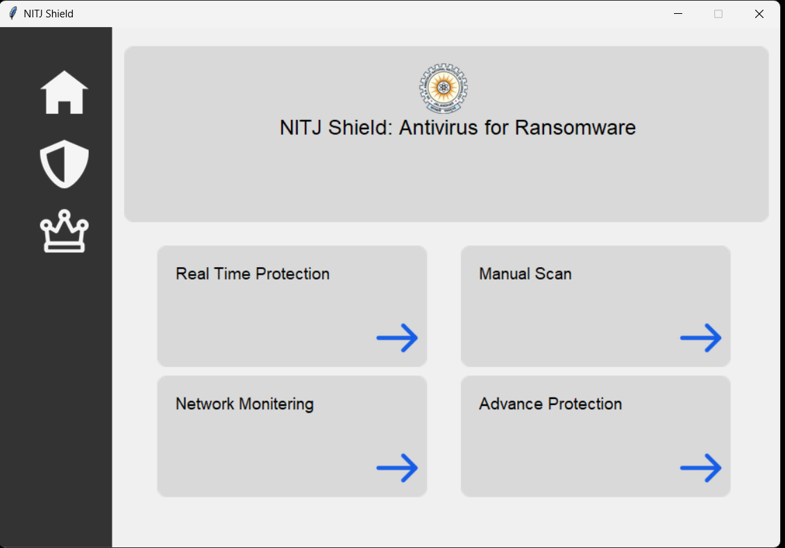

# Advance-Antivirus
Antivirus Created using python that provide all necessary protection argents antivirus 
 
 
 

# GUI
GUI is user friendly to provide better user experience 

## Reference

[python simple anti virus 1](https://github.com/Len-Stevens/Python-Antivirus)
 
[python simple anti virus 2](https://github.com/cookie0o/betterPYAV/tree/main?tab=readme-ov-file)
 
[Hash dataset](https://github.com/Len-Stevens/MD5-Malware-Hashes)
 
[Malware Detection using Machine Learning (ML)](https://github.com/Kiinitix/Malware-Detection-using-Machine-learning)
 
[windows-tools.antivirus 0.7.4 official python library](https://pypi.org/project/windows-tools.antivirus/)